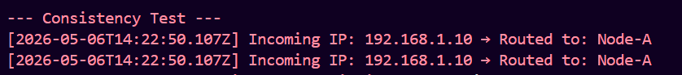

# Load Balancer Simulation (Infollion Task)

## Features
- Deterministic IP-based routing
- Same IP always maps to same node
- Logging with timestamp
- Traffic simulation

## Tech Stack
- Node.js
- JavaScript

## How to Run
```bash
run in one terminal: npm install
run in the second terminal: npm run simulate


